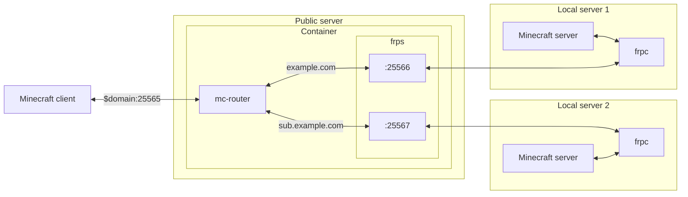

# minecraft-proxy

Proxy your local Minecraft server with a public server using your domain. It's not a Bungeecord or a plugin.

## Structure

Use [frp](https://github.com/fatedier/frp) to connect the local server to the container's port with the public server. Then use [mc-router](https://github.com/itzg/mc-router) to change the port to connect by domain.

## Environment value

### `FRP_VERSION`

Default: [`0.45.0`](https://github.com/fatedier/frp/releases/v0.45.0)

frps version to use.

### `FRP_ARGS`

Default: (empty)

frps command options. For example, you can set a token.

### `FRP_PORT`

Default: 7000

### `ROUTER_MAPPING`

**Require**

Mapping of address and port. For example: `example.com=frp:25565`
