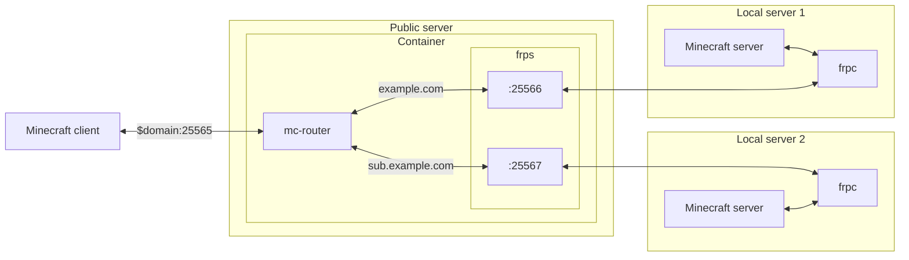

# minecraft-proxy

Proxy your local Minecraft server with a public server using your domain. It's not a Bungeecord or a plugin.

## Structure

Use [frp](https://github.com/fatedier/frp) to connect the local server to the container's port with the public server. Then use [mc-router](https://github.com/itzg/mc-router) to change the port to connect by domain.



## Usage

### Public server

1. Clone this repository.
2. Create `.env`.
3. Run `docker compose up -d`.

### Each local server

1. Download from [releases](https://github.com/fatedier/frp/releases).
2. Extract frpc from a downloaded file.
3. Create `frpc.ini`
4. Run `frpc -c frpc.ini`.

## Example

### Structure example

※ The public server address is `203.0.113.0`.

#### Public server

##### .env

```dotenv
ROUTER_MAPPING=example.com=frp:25566,sub.example.com=frp:25567
```

※ `frp` is the address that means frps container.

#### Local server 1

##### frpc.ini

```ini
[common]
server_addr = 203.0.113.0
server_port = 7000

[minecraft]
type = tcp
local_port = 25565
remote_port = 25566
```
#### Local server 2

##### frpc.ini

```ini
[common]
server_addr = 203.0.113.0
server_port = 7000

[minecraft]
type = tcp
local_port = 25565
remote_port = 25567
```

## Environment value

### `FRP_VERSION`

Default: [`0.46.1`](https://github.com/fatedier/frp/releases/v0.46.1)

frps version to use.

### `FRP_ARGS`

Default: (empty)

frps command options. For example, you can set a token.

### `FRP_PORT`

Default: 7000

### `ROUTER_MAPPING`

**Require**

Mapping of address and port. For example: `example.com=frp:25565`
